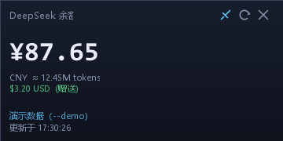
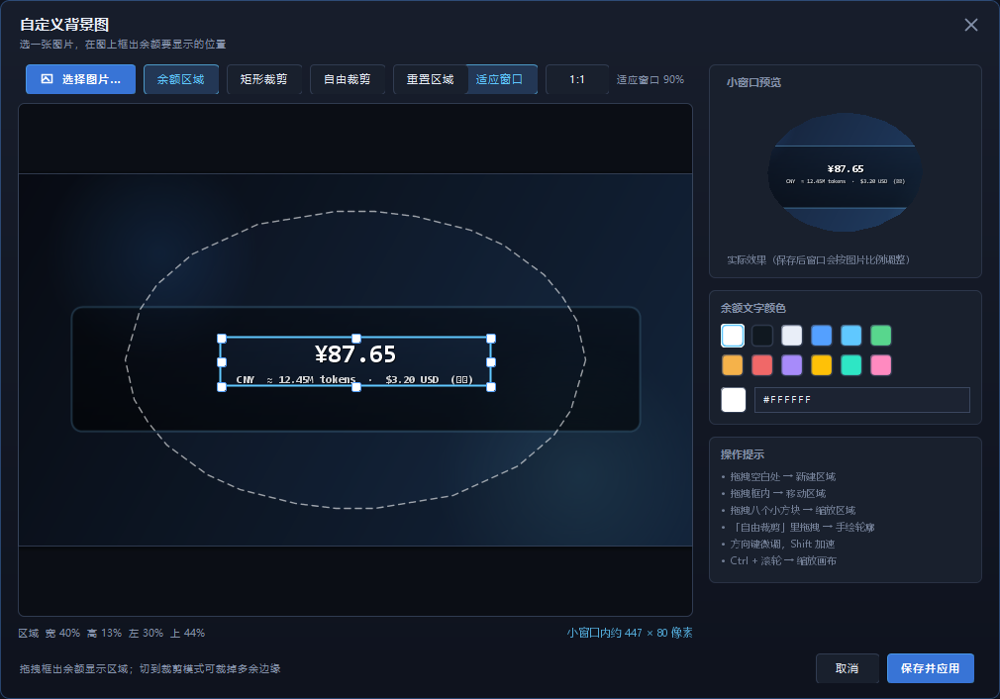
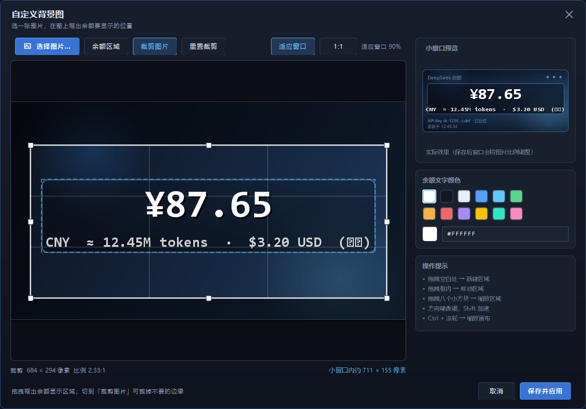
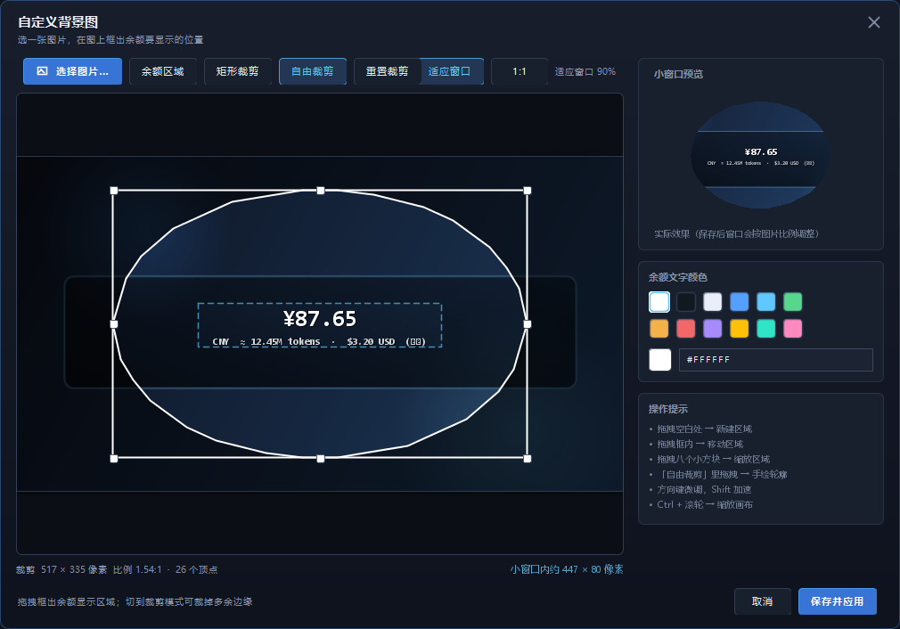
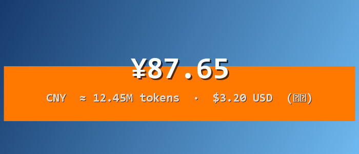
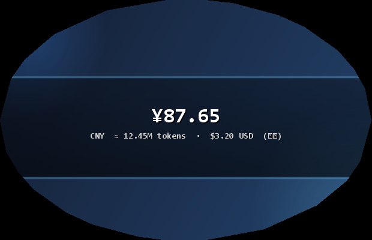
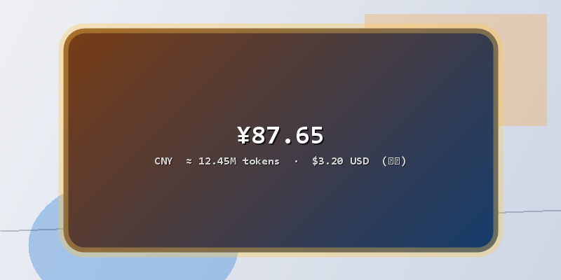

# DeepSeek 余额小窗口

一款 Windows 桌面小工具：使用 DeepSeek API Key 读取账户余额，以无边框小窗口常驻桌面，
定时自动刷新。



## 目录

- [功能特性](#功能特性)
- [环境要求](#环境要求)
- [运行方式](#运行方式)
- [使用方法](#使用方法)
- [配置与数据](#配置与数据)
- [命令行参数](#命令行参数)
- [接口](#接口)
- [项目结构](#项目结构)
- [已知限制](#已知限制)

## 功能特性

| 功能 | 说明 |
| --- | --- |
| API Key 登录 | 使用官方接口 `GET /user/balance`；登录前先联网校验，Key 错误立即提示 |
| 记住我 | 勾选后 API Key 加密保存到本机，之后每次启动直接显示余额 |
| 退出登录 | 右键菜单 →「退出登录」，清除本机保存的 Key 并返回登录界面 |
| 余额显示 | 主币种余额以大字号显示，其他币种分行列出 |
| 自定义背景图 | 上传自己的图片并框出显示区域，余额数字落在框内；图片复制到配置目录，原图可删 |
| 图片即窗口 | 选了背景图就不再画自己的圆角、边框与标题栏，图片本身成为窗口主体 |
| 透明图片 | 带 alpha 的 PNG 会按原样显示：透明处透出桌面，半透明边缘与桌面混合 |
| 裁剪图片 | 裁掉图片多余的边缘，小窗口只显示裁剪后的部分，窗口边缘与裁剪线一致 |
| 自由裁剪 | 手绘任意轮廓（套索），窗口直接变成那个形状——抠出来的主体就是窗口本身 |
| 自动刷新 | 默认 60 秒，可选 5 / 10 / 30 / 60 / 300 秒 |
| 字体大小 | 70%–250% 无级调节，整个界面等比缩放；也支持 `Ctrl + 滚轮` |
| 无边框窗口 | 无系统标题栏，深色圆角卡片样式 |
| 可拖动 | 在窗口空白处按住左键拖动 |
| 可缩放 | 拖拽四条边或四个角改变大小，最小尺寸随字体缩放；右键菜单提供预设尺寸（套用背景图后等比缩放） |
| 窗口置顶 | 默认开启，点击任务栏后仍保持在任务栏之上 |
| 开机自启 | 登录 Windows 后自动启动，写入当前用户注册表项，无需管理员权限 |
| 位置记忆 | 退出时保存窗口位置与尺寸 |
| 启动日志 | 记录每次启动的关键状态，便于排查开机自启是否生效 |

## 环境要求

| 用途 | 要求 |
| --- | --- |
| 运行（下载预编译版本） | Java 8 或更高版本（[下载](https://adoptium.net/)） |
| 运行（从源码构建） | 同上 |
| 构建 | JDK 8 或更高版本、Maven 3.x |
| 系统 | Windows（开机自启依赖注册表，其余功能跨平台可用） |

编译目标为 Java 8（class 版本 52），更高版本的 JRE 亦可运行。

## 运行方式

### 方式一：下载预编译版本

无需 JDK 与 Maven。

1. 打开 [Releases 页面](https://github.com/fcymz/dstokencheck/releases)，下载最新版的
   `dstokencheck.jar` 与 `run.bat`。
2. 将两个文件放入**同一个文件夹**（例如 `D:\dstokencheck\`）。
3. 双击 `run.bat`。

### 方式二：从源码构建

```bat
git clone https://github.com/fcymz/dstokencheck.git
cd dstokencheck
mvn clean package
run.bat
```

也可直接运行：

```bat
java -jar target\dstokencheck.jar
```

`run.bat` 按以下顺序查找程序，均不存在时打印提示并暂停：

1. `target\dstokencheck.jar`（本地构建产物）
2. 与 `run.bat` 同目录的 `dstokencheck.jar`（从 Releases 下载）

## 使用方法

### 首次登录

1. 启动后弹出登录窗口，粘贴 API Key。可在
   [platform.deepseek.com/api_keys](https://platform.deepseek.com/api_keys) 创建，
   点击窗口内的链接可直接打开该页面。
2. 如需免去后续输入，勾选「记住我」，再点击「登录」。
3. 程序会先请求一次余额确认 Key 有效，验证通过后才保存并显示余额。

### 窗口操作

| 操作 | 方式 |
| --- | --- |
| 移动窗口 | 在窗口空白处按住左键拖动 |
| 调整大小 | 拖拽窗口四条边或四个角（边缘 5 像素内按下即进入缩放） |
| 打开菜单 | 在窗口上点击右键 |
| 置顶开关 | 点击右上角图钉图标，或右键菜单 →「窗口置顶」 |
| 立即刷新 | 点击右上角刷新图标，或右键菜单 →「立即刷新」 |
| 隐藏窗口 | 点击右上角关闭图标（有背景图时该图标会隐藏，用右键菜单 →「退出」） |
| 更换背景 | 右键菜单 →「背景图…」，见 [自定义背景图](#自定义背景图) |

右键菜单包含：立即刷新、退出登录、开机自启、窗口置顶、窗口尺寸、背景图、恢复默认背景、字体大小、刷新间隔、退出。

### 字体大小

三种方式效果相同，均对**整个界面等比缩放**（而非只放大金额数字）：

- `Ctrl` + 鼠标滚轮：每次调整 5%
- 右键菜单 →「字体大小」：选择 80% / 100% / 125% / 150% / 175% / 200% / 250%，或「更大 / 更小」
- 右键菜单 →「字体大小」→「自定义…」：滑块在 70%–250% 之间无级调节，边拖边预览

调整时窗口按同比例自动缩放，避免文字被裁切；右上角图标同步缩放（最小 16 像素）。
窗口最小尺寸随字体变化：100% 时为 240×130，200% 时为 480×260。调整后仍可手动拖拽改变形状。

### 自定义背景图

右键菜单 →「背景图…」打开设置窗口（与主界面同一套深色卡片样式）：



左边是图片和框选区域，右边是**小窗口预览**、**文字颜色**和操作提示。工具条上有三个编辑模式：

- **「余额区域」**：框出余额数字显示的位置（默认模式）。
- **「矩形裁剪」**：拖八个方块裁掉图片不要的边缘，小窗口只显示裁剪后的那一块。
- **「自由裁剪」**：在图上直接**手绘一圈**（套索），裁出任意轮廓——抠出来的主体就是窗口的形状。





1. **选图片**：点左上角「选择图片…」，或者直接点一下左边的空白画布。
   支持 PNG / JPG / GIF / BMP。图片会被**复制**到 `%USERPROFILE%\.dstokencheck\`，
   之后原图移动或删除都不影响使用。
2. **框余额区域**：在「余额区域」模式下拖拽出数字显示的位置。框内会实时显示余额效果，
   区域之外会自动压暗。
3. **裁剪**：切到「矩形裁剪」拖八个方块，或切到「自由裁剪」在图上拖一圈。
   裁掉的部分会压暗；虚线框是余额区域，实线框（或手绘轮廓）是裁剪范围，两者始终同时可见。
   手绘的轨迹会自动简化成少量顶点（右侧读数会显示「26 个顶点」），拖动轮廓可以移动、
   拖八个方块可以整体缩放。
4. **调颜色**：右侧 12 个色块一点即换（当前颜色带白圈），也可以在输入框里填 `#RRGGBB`。
5. **看效果**：右侧「小窗口预览」就是保存后的样子——同一套绘制代码，不是示意图。
   自由裁剪时预览也会跟着变成那个轮廓。
6. 点「**保存并应用**」生效。没选图片时该按钮是灰的；点「取消」、按 `Esc` 或直接关窗
   都不会保存任何改动（本次导入的图片副本也会被清理）。

**图片就是窗口本身**：一旦选了背景图，应用自己那层卡片就彻底退场——不再画圆角、不再描边框、
不再叠加标题栏与底栏，图片的四条边就是窗口的四条边，图片上只剩余额数字。比例跟着裁剪走
（保存后自动调整），画面按裁剪范围铺满整个窗口：裁掉的部分不会漏进窗口，留下的部分也不会被切掉。
此后手动缩放窗口时也只能**等比缩放**，保证这个对应关系不被破坏。



**自由裁剪更进一步**：窗口直接用窗口区域（Region）做成你画的那一圈轮廓，轮廓外的像素根本不属于
这个窗口，点击也会穿透过去，桌面看到的形状就是你画的那个形状。



**带透明通道的图片也照原样显示**：如果图片有透明区域（抠图 PNG、带柔和边缘的贴图），窗口会切成
逐像素透明——透明处直接透出桌面，半透明的边缘也与桌面自然混合，不会被填成黑色。
编辑器与右侧预览用棋盘格标出这些区域，方便先确认哪些部分会被透掉。



操作方式：

| 操作 | 方式 |
| --- | --- |
| 新建区域／裁剪 | 在图片空白处拖拽（当前模式决定拖的是哪个框） |
| 手绘轮廓 | 「自由裁剪」模式下在图上拖一圈（矩形裁剪时先拖空白处即可开始画） |
| 移动框 | 在框内拖拽 |
| 缩放框 | 拖拽八个方块（四角＋四边中点；自由裁剪时整体缩放轮廓） |
| 切换模式 | 工具条「余额区域」/「矩形裁剪」/「自由裁剪」 |
| 微调位置 | 方向键（`Shift` + 方向键步长 10 像素） |
| 缩放画布 | `Ctrl` + 滚轮，或「适应窗口」/「1:1」 |
| 取消裁剪 | 「重置裁剪」；「重置区域」只重置余额框 |
| 关闭 | `Esc` 取消，`Enter` 等同「保存并应用」 |

底部会实时显示：裁剪模式是裁剪后的像素尺寸、比例与顶点数，区域模式是区域占比，
以及这个区域在小窗口里大约多少像素；如果余额区域（或其中的数字）超出了裁剪轮廓，
会变成黄字提醒「数字会被截断」。

说明：

- 区域与裁剪都按**图片比例**保存，所以小窗口缩放后数字仍然落在同一位置。
- **有背景图的窗口只显示图片与余额数字**：标题栏、窗口按钮、底部信息都不会叠在图片上。
  刷新、置顶、换图、改颜色、退出都在**右键菜单**里；平时唯一可能出现在图片上的文字，
  是刷新失败时左下角那一行红色小字（成功后自动消失）。
- **透明与半透明都保留**：图片带 alpha 时窗口走逐像素透明，透明处透出桌面，柔和的半透明
  边缘与桌面混合。编辑器画布与预览用棋盘格表示这些区域（棋盘格只出现在编辑器里，
  小窗口上不会画）。
- 字体大小在有背景图时只影响（已经隐藏的）界面文字，不会再改变窗口尺寸——窗口比例由裁剪决定。
- 「恢复默认背景」可随时回到内置深色卡片，并删除配置目录里的图片副本（连同裁剪设置）。

### 刷新间隔

右键菜单 →「每 N 秒刷新」，可选 5 / 10 / 30 / 60 / 300 秒，最低 5 秒。

### 开机自启

右键菜单勾选「开机自启」即可开启，取消勾选即关闭。

- **须以 `run.bat` 或 `java -jar dstokencheck.jar` 方式启动后才能设置。**
  在 IDE 中直接运行的是 `target\classes` 目录而非 jar，程序无法确定需注册的路径；
  此时点击菜单项会弹出说明，不会写入无效项。
- 开启时会把 jar 复制到稳定位置 `%LOCALAPPDATA%\dstokencheck\dstokencheck.jar`，
  注册表项指向该副本。副本过期时会在下次启动自动刷新。
- 注册表项位置：

  ```
  HKCU\Software\Microsoft\Windows\CurrentVersion\Run\DeepSeekBalanceBoard
  ```

- 随登录启动的实例若**没有可用的已保存 Key**，会静默退出而不弹出登录窗口。
  手动启动不受此影响。

**确认是否生效**：程序每次启动都会向 `%USERPROFILE%\.dstokencheck\startup.log`
追加记录。开机后查看该文件，出现本次开机时间的记录即表示已成功启动。

也可随时用命令核对：

```bat
java -jar target\dstokencheck.jar --autostart status
```

**关闭方式**（任选其一）：

- 右键菜单取消勾选「开机自启」
- 执行 `java -jar target\dstokencheck.jar --autostart off`
- 在注册表编辑器中删除上述项

### 退出登录

右键菜单 →「退出登录」，将清除本机保存的 API Key 并返回登录界面。
也可手动删除配置文件中的 `apiKeyProtected` 与 `rememberApiKey` 两行，或直接删除配置文件。

## 配置与数据

### 配置文件

位置：`%USERPROFILE%\.dstokencheck\config.properties`

```properties
apiKeyProtected=dpapi:...   # 加密后的 API Key，本机唯一的保存位置
rememberApiKey=true         # 是否记住
refreshSeconds=60           # 刷新间隔，最低 5 秒
fontScale=1.0               # 字体缩放，0.7 ~ 2.5
alwaysOnTop=true            # 窗口置顶
opacity=1.0                 # 窗口不透明度
window.x / window.y / window.width / window.height   # 窗口位置与尺寸
backgroundImage=background-1730000000000.png   # 自定义背景图（配置目录内的文件名）
imageCrop=0.0500,0.2000,0.9000,0.7000          # 裁剪范围 x,y,宽,高（相对图片的 0~1 比例），整图时不写
imageCropShape=0.84,0.50;0.82,0.64;…           # 自由裁剪的轮廓顶点（相对图片的 0~1 比例）；矩形裁剪时不写
balanceRegion=0.0800,0.3600,0.8400,0.2800      # 余额显示区域 x,y,宽,高（相对图片的 0~1 比例）
balanceTextColor=e9eef8                        # 余额文字颜色（RRGGBB）
```

`backgroundImage`、`imageCrop`、`balanceRegion`、`balanceTextColor` 只有在自定义背景图时才存在；
`background-*.png` 就是「背景图…」复制进来的图片副本。`imageCropShape` 只在自由裁剪时出现，
此时 `imageCrop` 是它的外接矩形（窗口比例按外接矩形算）。注意 `imageCrop` 与 `balanceRegion`
都是相对**原图**的比例，所以改裁剪不会让余额区域跟着跑。

同目录下的 `startup.log` 为启动日志，不含任何凭据。

### API Key 的加密

API Key 不会以明文写入磁盘。加密方案按平台自动选择，存储值带前缀以标识方案：

| 前缀 | 方案 | 适用场景 | 说明 |
| --- | --- | --- | --- |
| `dpapi:` | Windows DPAPI（`CryptProtectData`） | Windows（默认） | 密钥由 Windows 托管，绑定当前用户与本机；更换用户或复制到其他设备均无法解密 |
| `aesgcm:` | AES-256-GCM，密钥由 PBKDF2 从本机信息派生 | 非 Windows，或 DPAPI 调用失败时 | 可防止明文读取与跨设备复制，但属混淆级别 |

其他说明：

- Key 在保存前会先联网校验，避免存入无效值。
- 解密失败（更换用户或设备、文件损坏、内容被篡改）时返回 `null`，程序会清除无效配置
  并重新请求输入，不会反复启动失败。
- 未勾选「记住我」时，Key 仅存在于内存中，退出即失效。

**安全边界**：上述两种方案均无法防御已能以当前用户身份在本机执行代码的攻击者。
如需更强保护，请勿勾选「记住我」，每次启动手动输入。

## 命令行参数

```bat
:: 在终端中验证 Key 并打印余额
java -jar target\dstokencheck.jar --diag <API_KEY>

:: 查看 / 开启 / 关闭开机自启（与右键菜单等价）
java -jar target\dstokencheck.jar --autostart status
java -jar target\dstokencheck.jar --autostart on
java -jar target\dstokencheck.jar --autostart off

:: 自测：拖动、缩放、最小尺寸、菜单项、字体缩放、刷新下限、背景图与裁剪等
java -jar target\dstokencheck.jar --selftest

:: 将窗口离屏渲染为 PNG
java -jar target\dstokencheck.jar --shot <输出目录>

:: 演示模式：不联网，使用示例数据预览界面
java -jar target\dstokencheck.jar --demo

:: 随 Windows 登录启动（由注册表项自动传入，一般无需手动使用）
java -jar target\dstokencheck.jar --at-logon
```

`--selftest` 全部通过时返回码为 0。

## 接口

本工具仅使用一个官方公开接口：

```
GET https://api.deepseek.com/user/balance
Authorization: Bearer <API_KEY>
```

响应示例：

```json
{
  "is_available": true,
  "balance_infos": [
    {
      "currency": "CNY",
      "total_balance": "87.65",
      "granted_balance": "0.00",
      "topped_up_balance": "87.65"
    }
  ]
}
```

参考文档：[Get User Balance | DeepSeek API Docs](https://api-docs.deepseek.com/api/get-user-balance/)

## 项目结构

```
src/main/java/com/ruoyi/dstokencheck/
├── Main.java                     入口：界面编排与命令行参数分发
├── config/AppConfig.java         配置读写
├── security/SecretStore.java     API Key 加密（DPAPI 优先，AES-GCM 兜底）
├── autostart/AutoStart.java      开机自启：读写 HKCU Run 注册表项
├── model/
│   ├── Wallet.java               单个币种钱包
│   ├── BalanceSnapshot.java      一次刷新的完整快照与币种汇总
│   └── CropShape.java            裁剪轮廓（多边形）：简化、缩放、序列化、转成窗口形状
├── net/
│   ├── Http.java                 基于 HttpURLConnection 的 HTTP 封装
│   └── DeepSeekClient.java       余额接口调用与 Key 掩码显示
└── ui/
    ├── Theme.java                颜色、字体与共用的小段绘制代码
    ├── CardPanel.java            圆角渐变卡片（各窗口共用的底）
    ├── FlatButton.java           扁平的圆角按钮（主要／次要两种）
    ├── IconButton.java           自绘矢量图标按钮
    ├── ApiKeyDialog.java         无边框登录窗口
    ├── BackgroundLayout.java     图片摆放与框选区域换算（小窗口、编辑器、预览共用）
    ├── BalanceTextRenderer.java  把余额数字缩放到任意方框内绘制
    ├── BackgroundRegionDialog.java  背景图编辑器：选图、框区域、调颜色、实时预览
    └── BalanceBoard.java         无边框主窗口（自实现拖动、缩放、置顶、退出登录）

tools/                            开发期工具，不影响程序运行
├── SecretProbe.java              验证加密与「记住我」存取
├── capture-window.ps1            真实截屏指定窗口，用于验证渲染
├── window-timeline.ps1           按时间轴输出窗口出现顺序
├── verify-topmost.ps1            抬起任务栏并校验窗口 z-order
├── scan-chunks.ps1               扫描平台前端资源以定位接口
├── apikey-window.png             登录窗口渲染效果
├── demo-window.png               小窗口渲染效果
├── background-window.png         自由裁剪（轮廓窗口）下的小窗口渲染效果
├── background-window-rect.png    矩形裁剪下的小窗口：就是图片本身，无边框无标题栏
├── background-window-alpha.png   带透明通道的图片：透明处透出桌面
├── background-dialog.png         背景图设置窗口渲染效果
├── background-crop.png           矩形裁剪模式的渲染效果
└── background-free.png           自由裁剪（手绘轮廓）模式的渲染效果
```

开发期工具不会读写真实配置：`capture-window.ps1` 与 `window-timeline.ps1` 会将
`user.home` 指向 `%TEMP%` 下的临时目录后再启动程序。`SecretProbe.java` 读写的是
`user.home`，运行时请自行加上 `-Duser.home=%TEMP%\probe` 隔离。

## 已知限制

- 跨币种余额不做汇率换算，仅汇总同一币种，避免产生无意义的总数。
- 无边框窗口没有系统标题栏，拖动与缩放均由程序自行实现，因此在窗口边缘 5 像素内按下即进入缩放。
- 仅缓存余额数据，不保存余额以外的任何账户信息。
- 自定义背景图会**复制**一份到 `%USERPROFILE%\.dstokencheck\`（不修改原图）；删除图片副本即等于放弃背景图。
- 自定义背景图模式下，币种、可用 token 估算、赠送与其他币种会合并成一行小字显示在框定区域内。
- 套用背景图后窗口只能**等比缩放**：窗口边缘要一直压在裁剪线上，自由拉边会让画面被切或被压扁。
  需要别的比例时，改裁剪范围即可。
- 有背景图时窗口不画任何应用自己的装饰（圆角、边框、标题栏、底栏），操作全部走右键菜单。
- 带透明通道的图片会让窗口走**逐像素透明**（由系统合成，比普通窗口稍费一点资源）。
  若系统不支持窗口透明，透明区域会退化为深色，并在图片上留一行提示。
- 自由裁剪的轮廓只能整体移动、等比缩放或重新画：不支持单独拖动某一个顶点。
  轮廓顶点上限 96 个，手绘轨迹会自动简化到远低于这个数，保证窗口移动时不卡。
